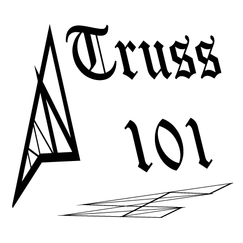

  

  
  
  
  
  

  
  
  

# Truss 101
A desktop application to solve statically determinate and indeterminate 2D truss structures using Matrix Displacement Method (aka Finite Element Method).

## Where to download?

  

## Why Truss 101?
* Develop Structures using Nodes and Members
* Unit conversion
* Supports
  * Pinned and Roller support 
  * Stability check
* Multiple loads at the same point
* Individual property for members 
  * Modulus of Elasticity (E)
  * Area (A)
* Nodal displacements
  * Graphs
  * Tabulated
  * Animation
* Member forces and support reactions
  * Graphs showing members relative strength
  * Tension, compression value in Tabulated form
* Multiple projects
* Beautiful Report 
  * Input-Output data
  * Member Stiffness Matrices
  * Global Stiffness Matrix
  * Force Matrix

# Tutorial 

# TO DO

* Influence line for a unit load
* 3D truss

# Known Issues
Program works fine. Just two bugs in Report.
* Constrained global stiffness matrix is not removing constrained rows in Report.
* Force matrix shows wrong degrees of freedom in Report. Those dofs should be incremented by 1.
* Support nodes value greater than 10 is not reading correctly when opened from saved files.

These will be patched in the next update.

> I welcome any feedback at as2robot143@gmail.com

